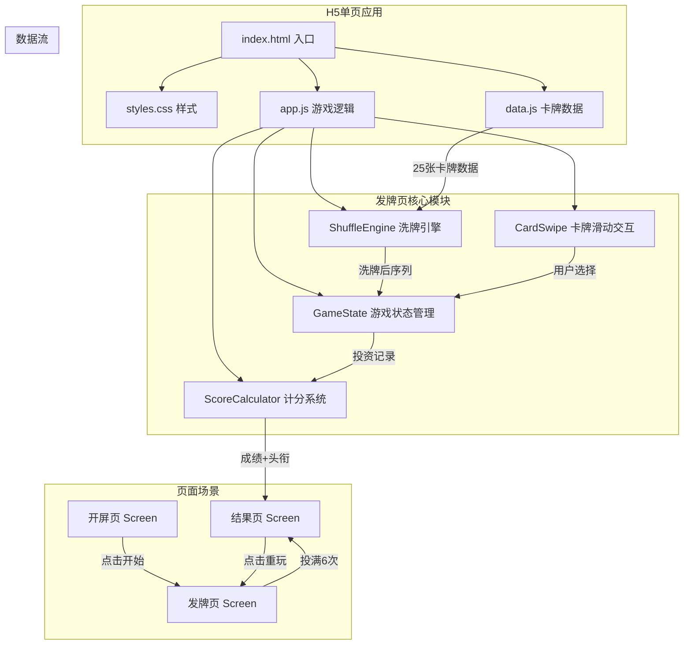

## 产品概述

以"伯克希尔哈撒韦股东会"为背景，制作一期可交互的H5专题页，主题为《巴菲特：从未亮出的那张底牌》。以巴菲特热爱桥牌为切入点，让用户与"巴菲特"进行一场投资卡牌博弈，从中体验价值投资的智慧与教训。

## 核心功能

### 1. 开屏页

- 展示H5主题标题《巴菲特：从未亮出的那张底牌》
- 预留"巴菲特思考"动画占位区域（后续替换）
- 用户点击"开始"按钮进入发牌界面
- 简要规则说明：你有6次投资机会，巴菲特会依次出牌，选择投资或放弃

### 2. 发牌界面

- 预留"巴菲特发牌"动画占位区域（后续替换）
- 25张卡牌随机打乱顺序依次展示，每次展示一张
- 卡牌正面展示：图腾名称、图腾描述（视觉区域）、谜面文字
- 顶部状态栏显示：当前第几张牌（如 3/25）、剩余投资机会数（如 剩余5次机会）
- 用户通过左划（放弃/PASS）或右划（投资/IN）做出选择，附带滑动动画反馈
- 滑动时卡牌倾斜+透明度变化，松手后飞出或回弹
- 选择后短暂展示结果提示（对应交互提示语），然后自动进入下一张牌
- 当6次投资机会用完后，剩余牌自动跳过，进入结果页

### 3. 结果页

- 根据用户6次投资选择的案例类型和收益率计算总成绩，给出投资者头衔
- 逐一揭晓用户选中的6家公司：谜底、投资结果、巴菲特的实际决策、投资理论、巴菲特原话
- 每张结果卡片用颜色区分正确/错误选择
- 提供"查看其他公司"入口，用户可浏览未选中的卡牌的谜底信息
- 底部提供分享/重玩按钮

### 4. 数据与规则

- 25张卡牌数据全部来自 report.md，包含4类案例：成功案例6张、失败案例4张、错过案例10张、明智拒绝案例5张
- 卡牌随机排序，但保持平衡性（前5张至少包含不同类型案例各1张）
- 用户共有6次"投资"机会，选"过"永久跳过
- 计分规则：成功案例投对加分、失败案例投错扣分、错过案例投对加分、明智拒绝投错扣分
- 头衔系统：根据累计收益率和正确率划分段位（如"巴菲特接班人"、"华尔街新秀"、"韭菜本菜"等）

## 技术栈

- 架构框架：纯 HTML + CSS + JavaScript（单页H5，无需构建工具）
- 样式方案：CSS3 动画 + 触摸手势交互
- 数据管理：卡牌数据以 JS 对象数组形式内嵌在代码中（从 report.md 提取）
- 手势交互：原生 Touch Event API（touchstart/touchmove/touchend）
- 动画效果：CSS transition/animation + requestAnimationFrame
- 适配方案：rem + viewport meta 移动端适配

## 实现方案

### 整体策略

采用单HTML文件 + 内联CSS/JS 的纯前端方案，通过页面内多个"场景容器"（开屏页、发牌页、结果页）的显示/隐藏实现页面切换，无需路由库。卡牌滑动交互基于原生 Touch 事件实现 Tinder 风格的左右滑动效果。所有25张卡牌数据硬编码为 JS 数据结构，游戏状态通过闭包/模块管理。

### 关键技术决策

1. **单文件 vs 多文件**：采用单 HTML 入口 + 独立 JS/CSS 文件的结构。数据量较大（25张卡牌），将数据、逻辑、样式分离以保持可维护性。最终部署可合并。

2. **手势交互方案**：使用原生 TouchEvent 而非第三方手势库（如 Hammer.js），避免外部依赖违反域名白名单规则。实现左右滑动判定（位移阈值 > 80px 触发选择），滑动过程中卡牌跟随手指移动并倾斜（transform: rotate + translateX）。

3. **卡牌洗牌算法**：采用 Fisher-Yates 洗牌算法随机打乱25张牌，但增加约束保证前5张包含至少1张成功、1张失败、1张错过、1张明智拒绝案例，提升前期体验多样性。

4. **动画占位策略**：开屏动画和发牌动画区域使用 CSS 动画占位（如扑克牌翻转、渐入效果），预留 `<div class="animation-placeholder">` 容器，后续替换为实际动画资源（Lottie/APNG/视频等）。

5. **计分与头衔系统**：

- 成功案例选"投" → 正确，+对应回报率分数
- 失败案例选"投" → 错误，+对应亏损分数（负值）
- 错过案例选"投" → 正确，+潜在回报率分数
- 明智拒绝选"投" → 错误，+崩盘损失分数（负值）
- 明智拒绝选"过" → 正确，+10%避坑奖励
- 根据正确决策数量（0-6）映射6个头衔等级

### 性能考量

- 卡牌谜面文本较长（150-200字），采用滚动区域展示，避免小屏溢出
- 手势滑动使用 transform（GPU加速）而非 left/top 定位，保证60fps流畅度
- 结果页大量文本内容采用懒加载展开，初始只展示摘要

## 实现注意事项

1. **域名白名单**：所有资源使用相对路径引用，不引入任何外部CDN/字体/库。字体使用系统字体栈。
2. **触摸事件**：需处理 `preventDefault()` 防止页面跟随滑动，但注意 iOS Safari 的 passive event listener 要求。
3. **卡牌数据完整性**：25张卡牌每张包含11个字段（编号、图腾名称、图腾描述、谜面、谜底、游戏结果、投资结果、投资理论、巴菲特原话、交互提示语-投、交互提示语-过），数据提取时需确保无遗漏。
4. **向后兼容**：动画占位容器需约定明确的DOM结构和CSS类名，方便后续替换时不影响周边布局。

## 架构设计



## 目录结构

```
buffett_bridge/
├── report.md                # [现有] 原始卡牌内容策划文档
├── index.html               # [新建] H5主入口文件。包含三个场景容器（开屏页、发牌页、结果页），viewport适配meta标签，引用CSS和JS文件。DOM结构包括：开屏区域（动画占位+标题+开始按钮）、发牌区域（状态栏+卡牌容器+操作提示）、结果区域（头衔展示+投资结果列表+未选公司展开区+重玩按钮）
├── css/
│   └── styles.css           # [新建] 全局样式文件。包含：CSS变量定义（复古金融色系）、页面场景切换动画、卡牌样式（深绿背景/金色描边/做旧质感）、滑动交互视觉反馈（倾斜/透明度/飞出动画）、结果页布局、移动端rem适配、头衔徽章样式、滚动条美化
├── js/
│   ├── data.js              # [新建] 25张卡牌数据模块。从report.md提取所有卡牌字段，以数组形式导出。每张卡牌对象包含：id、totemName、totemDesc、riddle、answer、type（success/failure/missed/wise_pass）、investResult、theory、buffettQuote、tipInvest、tipPass、scoreValue等字段
│   └── app.js               # [新建] 游戏核心逻辑。包含：GameState类（当前牌索引、已投资列表、剩余机会数）、ShuffleEngine（Fisher-Yates洗牌+前5张类型平衡约束）、CardSwipe类（Touch事件绑定/滑动判定/动画控制）、ScoreCalculator（收益率累计+头衔映射）、页面场景切换控制器、结果页渲染逻辑
└── assets/
    └── placeholder/         # [新建] 动画占位资源目录，后续替换实际动画文件
```

## 关键数据结构

```typescript
// 卡牌数据接口定义
interface CardData {
  id: number;                    // 卡牌编号 1-25
  totemName: string;             // 图腾名称
  totemDesc: string;             // 图腾描述（用于视觉区域）
  riddle: string;                // 谜面（核心展示文本）
  answer: string;                // 谜底（如"可口可乐（1988年）"）
  type: 'success' | 'failure' | 'missed' | 'wise_pass';  // 案例类型
  investResult: string;          // 投资结果详情
  theory: string;                // 投资理论
  buffettQuote: string;          // 巴菲特原话
  tipInvest: string;             // 选"投"的提示语
  tipPass: string;               // 选"过"的提示语
  scoreValue: number;            // 收益率分值（正数为盈利/百分比，负数为亏损）
  isCorrectToInvest: boolean;    // 选"投"是否为正确选择
}

// 头衔等级（按正确决策数 0-6）
type TitleLevel = 
  | '巴菲特接班人'      // 6/6 正确
  | '价值投资大师'      // 5/6 正确
  | '华尔街操盘手'      // 4/6 正确
  | '稳健型基金经理'    // 3/6 正确
  | '散户进阶中'        // 2/6 正确
  | '投资新手村'        // 1/6 正确
  | '韭菜本菜';         // 0/6 正确
```

## 设计风格

采用复古金融+高端桥牌俱乐部风格，打造沉浸式的"与巴菲特打牌"体验。整体色调以深墨绿、金色、米白为主，融合做旧纸张质感和古典金融插画元素，营造1960-80年代华尔街的厚重氛围。

## 全局视觉规范

- 背景采用深墨绿色桌布质感（模拟桥牌桌面），搭配细微噪点纹理增加真实感
- 所有卡片元素使用金色描边+圆角矩形，呈现高端扑克牌质感
- 文字排版强调古典金融气质，标题使用衬线体风格，正文使用无衬线清晰体
- 微动画贯穿全程：卡牌入场、翻转、飞出、揭晓等均有流畅过渡

## 页面设计

### 第一页：开屏页

**区块1 - 动画区域**

- 页面顶部2/3区域为"巴菲特思考"动画占位区，暗色背景，中央放置巴菲特剪影+手持扑克牌的静态插画占位
- 占位动画：扑克牌缓慢翻转的CSS动画循环

**区块2 - 标题区**

- 主标题《巴菲特：从未亮出的那张底牌》，金色大字，带微光闪烁动画
- 副标题"伯克希尔哈撒韦2026股东会特别策划"，米白色小字

**区块3 - 规则简介**

- 深色半透明卡片，金色描边，内含三行简明规则：巴菲特会向你出25张投资牌 / 你只有6次投资机会 / 选了就不能反悔，过了就不能回头
- 每行配小图标（扑克牌/数字6/箭头）

**区块4 - 开始按钮**

- 底部居中大按钮"坐上牌桌"，金色渐变填充，hover/tap时有按压反馈
- 按钮下方小字"准备好了吗？"

### 第二页：发牌界面

**区块1 - 顶部状态栏**

- 左侧显示当前进度"第 X/25 张"，右侧显示剩余机会"剩余 N 次机会"，机会数用金色圆形徽章展示
- 状态栏背景深色，与牌桌融为一体

**区块2 - 卡牌展示区（核心）**

- 页面中央大卡牌（宽度约85vw，高度自适应），深墨绿底+金色粗描边+圆角
- 卡牌顶部：图腾名称（金色大字）+ 图腾描述区域（用文字描绘画面，配深色背景方块模拟图腾位置）
- 卡牌中下部：谜面文字，米白色，可滚动区域（长文本适配）
- 卡牌四角装饰：经典扑克牌角标样式，显示卡牌序号

**区块3 - 滑动操作提示**

- 卡牌下方两侧箭头提示：左侧红色"PASS（放弃）"，右侧绿色"IN（投资）"
- 滑动过程中卡牌跟随手指偏移并倾斜，左偏时边框变红+PASS浮现，右偏时边框变绿+IN浮现
- 松手判定后卡牌飞出屏幕（左/右方向），同时底部弹出对应的交互提示语Toast（2秒自动消失）

**区块4 - 投资记录指示器**

- 底部6个圆形指示点，已使用的变为金色实心，未使用的为金色空心描边
- 当所有6个点亮起时触发结果页转场

### 第三页：结果页

**区块1 - 头衔揭晓**

- 顶部大字展示用户获得的头衔（如"价值投资大师"），配金色光晕动画
- 下方展示统计数据：正确决策 X/6，累计收益率 XX%

**区块2 - 投资回顾（6张已选卡片）**

- 纵向卡片列表，每张卡片展示：谜底公司名（大字）、案例类型标签（成功/失败/错过/明智拒绝）、用户选择是否正确的标记（对勾/叉号）
- 点击卡片展开详情：投资结果、投资理论、巴菲特原话
- 正确选择的卡片边框为金色，错误选择为暗红色

**区块3 - 未选公司区域**

- "查看其他牌面"折叠区域，点击展开显示未被选中公司的简要信息（谜底+一句话结果）
- 网格布局，每个小卡片可点击查看完整详情

**区块4 - 底部操作**

- "再来一局"按钮（重新洗牌），"分享战绩"按钮（预留）
- 底部版权文字"伯克希尔哈撒韦2026股东会特别策划"

## Agent Extensions

### Skill

- **frontend-design**
- 用途：用于生成高品质、生产级别的H5交互页面，确保复古金融+桥牌风格的视觉设计达到专业水准
- 预期结果：生成具有精美动画、滑动交互、复古质感的完整H5页面代码

- **多模态内容生成**
- 用途：为卡牌图腾生成视觉插画素材，以及开屏页/发牌页的占位动画视觉效果
- 预期结果：生成符合"复古金融插画"风格的图腾图片资源

- **image-upload**
- 用途：将生成的图腾插画和动画占位图片上传到腾讯CDN
- 预期结果：获取白名单域名下的CDN URL，可在H5中安全引用
